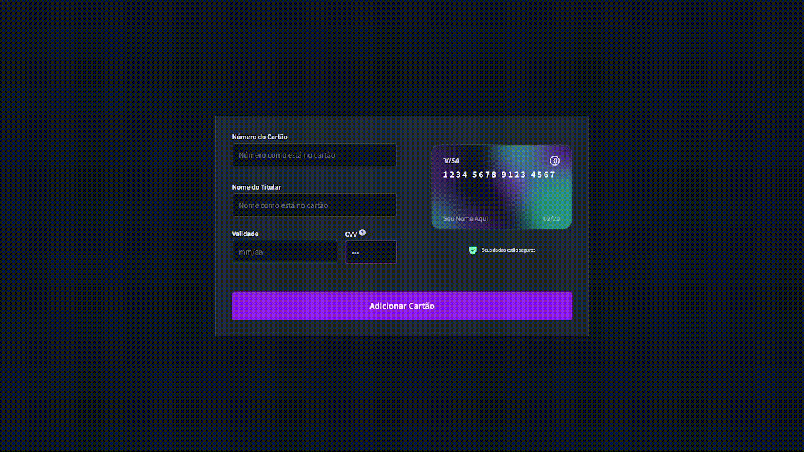
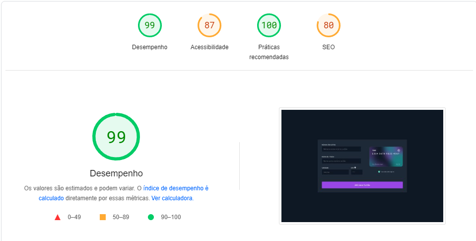
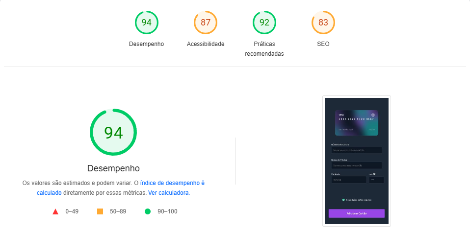
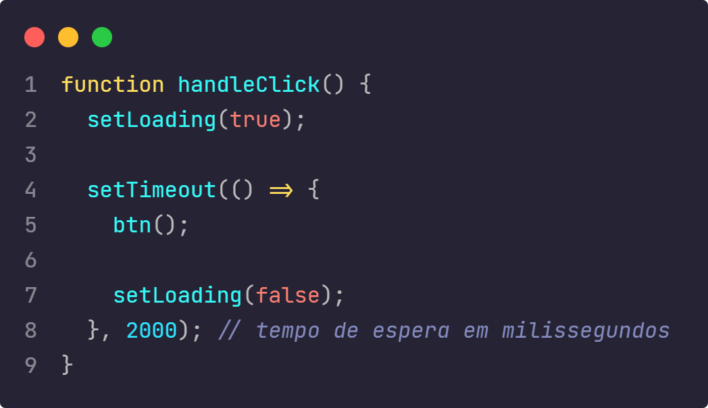
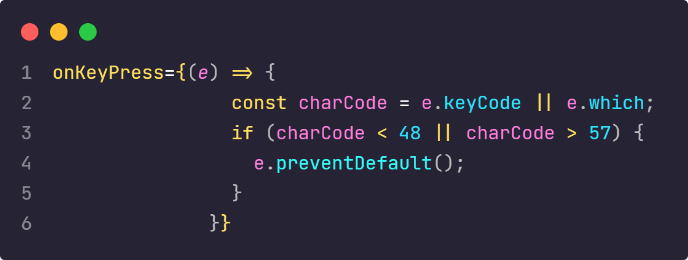

<h1 align="center">Bora Code 13</h1>

  
  
  

## Documentação
  - <a href="#projeto">Projeto</a>
  - <a href="#diario"> Diário de bordo </a>
  - <a href="#estrutura"> Estrutura do Projeto</a>
    - <a href="#stacks"> Stacks</a>
    - <a href="#stacks"> Cores</a>
    - <a href="#wakatime"> Distribuição do Tempo</a>
    - <a href="#page"> PageSpeed Insights</a>
  - <a href="#melhorias"> Melhorias</a>
  - <a href="#destaque">Destaque para alguns códigos</a>

<h2 id="projeto"> Projeto </h2>

> Bora codar 12, desenvolva um forms de cartão, <a href="https://bora-codar-13-71dy.vercel.app/" >Link para o resultado</a>

<h2 id="diario"> Diário de bordo </h2>
<table>
  <thead>
        <tr>
            <th align="center">
                 
                

                    <small>DATA</small>
                

            </th>
            <th align="center">
                 
                
 
                    <small>
                        TAREFA
                    </small>
                

            </th>
            <th align="left">
                
                
 
                    <small>
                     TEMPO
                    </small>
                

            </th>
            <th align="center">
                
                
 
                    <small>
                      COMMITS
                    </small>
                

            </th>
        </tr>
    </thead>
    <tbody>
          <tr>
            <td>01/04</td>
            <td><a href="#estrutura">Estruturação e Design</a></td>
            <td>2h 4m</td>
            <td align="center">
            <a href="#commits">9</a></td>
        </tr>
        <tr>
            <td>02/04</td>
            <td><a href="#estrutura">Design</a></td>
            <td>45m</td>
            <td align="center">
            <a href="#commits">1</a></td>
        </tr>
        <tr>
            <td>03/04</td>
            <td><a href="#estrutura">Responsividade</a></td>
            <td>1h 21m</td>
            <td align="center">
            <a href="#commits">2</a></td>
        </tr>
        <tr>
            <td>04/03</td>
            <td><a href="#estrutura">Máscara nos inputs</a></td>
            <td>3h 19m</td>
            <td align="center">
            <a href="#commits">3</a></td>
        </tr>
        <tr>
            <td>05/03</td>
            <td><a href="#estrutura">Finzalização e deploy (primeira parte)</a></td>
            <td>2h 12m</td>
            <td align="center">
            <a href="#commits">1</a></td>
        </tr>
    </tbody>
</table>

<h2 id="estrutura"> Estrutura do Projeto </h2>

<h3 id="stacks"> Stacks utilizadas </h3>
  <strong>Gsap,  <strong>
  <strong>Google Fonts,<strong>
  <strong>Figma,<strong>
  <strong>Wakatime,<strong>
  <strong>Pagespeed<strong>
  
<h3 id="cores">Cores do Projeto</h3>

| Cor               | Hexadecimal                                                |
| ----------------- | ---------------------------------------------------------------- |
| Brand Color      |  #9333EA |
| Brand Color Light     |  #A855F7 |
| Gray 900     |  #1F2937 |
| Gray 800     |  #374151 |
| Gray 700     |  #4B5563 |
| Gray 600     |  #111827 |
| Gray 500     |  #6B7280 |
| Gray 400     |  #9CA3AF |
| Gray 300     |  #D1D5DB |
| Gray 200     |  #E5E7EB |
| Gray 100     |  #F3F4F6 |
| Gray 50     |  #F9FAFB |
| Status Sucess     |  #6EE7B7 |
| Status Error     |  #FB7185 |

<h3 id="wakatime">Tempo distribuido em linguagens </h3>

| # | Tempo         | linguagem                                      |
|--| ----------------- | ---------------------------------------------------------------- |
| # |  9hrs 43mins | JavasScript (react) |

<h3 id="page">PageSpeed Insights</h3>
Dados do computador 
 
Dados para os dispositivos movéis 

<h2 id="melhorias"> Melhorias ao Projeto</h2>

- Temas
- Crud simples
- Validação de bandeira
- Flip para CVV

<h2 id="destaque">Destaque para alguns códigos</h2>

## Licença

[MIT](./LICENSE)
